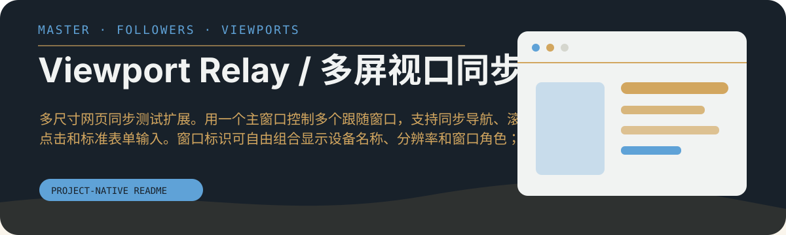

# Viewport Relay / 多屏视口同步

多尺寸网页同步测试扩展。用一个主窗口控制多个跟随窗口，支持同步导航、滚动、DOM 点击和标准表单输入。窗口标识可自由组合显示设备名称、分辨率和窗口角色；启动页还提供本地近期网址记录。

<p align="center">
  
</p>


A multi-viewport web testing extension. One master controls multiple followers with synchronized navigation, scrolling, DOM-aware clicks, and standard form input. Window labels can show any combination of device name, resolution, and role, while recent URLs stay local to the browser.

密码、文件选择、隐藏字段和一次性验证码不会同步。输入同步默认关闭，所有同步数据只在当前 Chrome 会话内传递。

Passwords, file pickers, hidden fields, and one-time codes are never synchronized. Input sync is off by default, and live synchronization data remains inside the current Chrome session.


[Repo](https://github.com/holynova/multi-screen-view) · [Pages](https://holynova.github.io/multi-screen-view/)

## 安装到 Chrome

1. 克隆或下载本仓库，保留根目录的 `manifest.json`。
2. 打开 `chrome://extensions/`，开启开发者模式。
3. 选择“加载已解压的扩展程序”，选中仓库根目录。
4. 点击扩展按钮打开启动页，输入测试网址并选择视口。

在主窗口中导航、滚动或点击，观察跟随窗口的响应。输入同步需手动开启；敏感字段仍会排除。GitHub Pages 是项目页面，不能替代安装扩展。

## 开发与打包

```bash
npm test
npm run package:extension
```

测试包含脚本语法、行为和商店素材校验。权限清单见 [manifest.json](manifest.json)，数据处理说明见 [隐私政策](privacy.html)。
